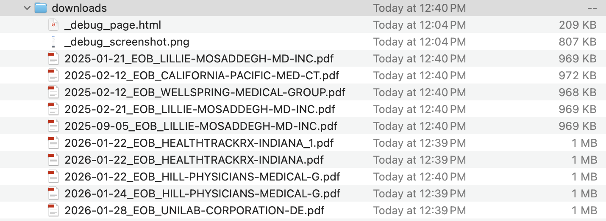

# Anthem EOB Bulk Downloader

## Background

I like to keep organized records of my medical paperwork, but Anthem doesn't offer an API or bulk download option for Explanation of Benefits documents. So I did what any reasonable person would do: spent way too long building a Playwright script that connects to my browser, clicks download buttons, and renames the files nicely. You're welcome, future me.

## Usage

1. Install dependencies: `npm install`
2. Install Playwright browsers: `npx playwright install chromium`
3. Run `./start-brave.sh` to launch Brave with remote debugging enabled
4. In Brave, go to `brave://settings/content/pdfDocuments` and enable "Download PDFs"
5. Navigate to https://membersecure.anthem.com/member/eob-center/medical and log in
6. Run `node download-eobs.js`
7. PDFs are saved to `./downloads/` as `YYYY-MM-DD_EOB_provider-name.pdf`

## AI Coding Learnings

Three things I learned building this with Claude:

1. **Claude Code expands what's possible.** Before this, I wouldn't have even considered building a Playwright agent to automate clicks when logged into an insurer's portal. Now it exists and works. How many opportunities like this lie unexplored?

2. **"Wait and think" helps.** When we hit a dead end with clicks not triggering downloads, I asked Claude to pause and reconsider. It shifted from simple `.click()` to CDP mouse events trying to simulate human behavior. It didn't work, but watching the approach evolve was interesting.

3. **Prompting to search was the breakthrough.** Despite being trained on web data, Claude didn't think to search for the solution. When I asked it to look up "playwright downloads not working," it found the actual fix: using `waitForEvent('download')` and `download.saveAs()` for CDP connections. Sometimes the best prompt is "go look it up."
